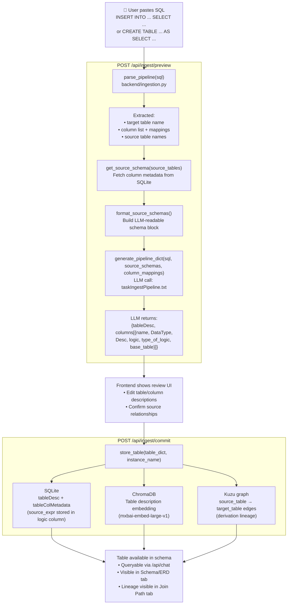

# Poly-QL — Ingest Pipeline Flow

How a pipeline SQL statement becomes a documented table in the schema.



## Qualified Name Support (C4)

Pipeline SQL can reference tables with fully-qualified names (`database.schema.table`).
`parse_pipeline()` uses alternation regex to capture quoted and unquoted forms:

```
backtick:      `database.schema.table`
double-quote:  "database.schema.table"
bracket:       [database.schema.table]
bare:          database.schema.table  (dot-separated \w+ tokens)
```

All four forms are normalised to a plain string and stored as-is in the metadata tables.
The `_extract_name()` helper selects the first non-None capture group from the regex match.

## Supported SQL Forms

| Form | Example |
|------|---------|
| `INSERT INTO ... SELECT` | `INSERT INTO target (col1, col2) SELECT a, b FROM source` |
| CTAS | `CREATE TABLE target AS SELECT ...` |
| CTAS with IF NOT EXISTS | `CREATE TABLE IF NOT EXISTS target AS SELECT ...` |
| Qualified target | `INSERT INTO db.schema.target (...)` |
| Qualified sources | `FROM prod.sales.orders o JOIN prod.dim.customers c ON ...` |
