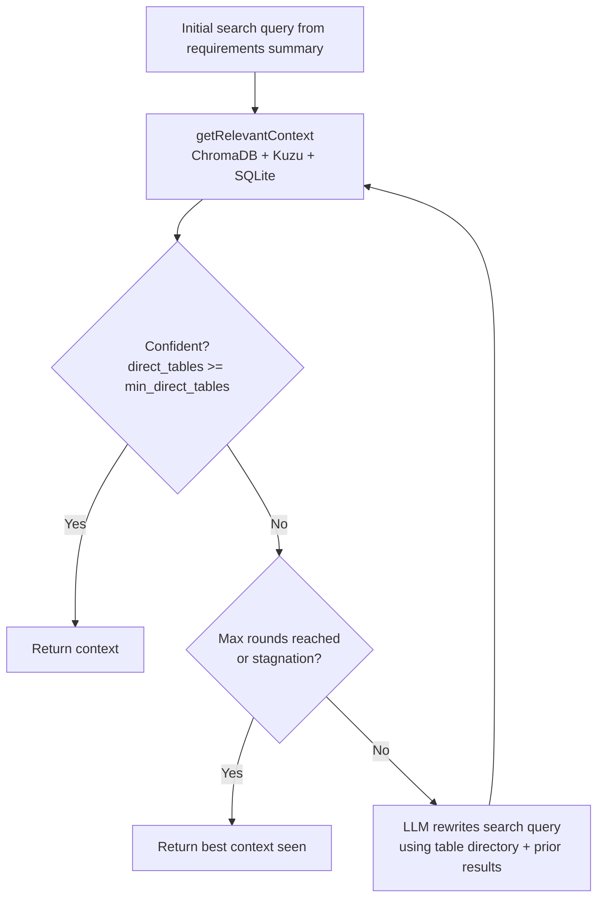

# Poly-QL — Two-Agent Query Flow

Sequence diagram for the full lifecycle of a user question from input to generated SQL.

```mermaid
sequenceDiagram
    autonumber
    actor User
    participant FE as Frontend<br/>(ChatInterface)
    participant BE as FastAPI<br/>(POST /api/chat/stream)
    participant Gather as gatherRequirements()<br/>Phase 1 Agent
    participant Gen as generateQuery()<br/>Phase 2 Agent
    participant LLM as LLM Provider
    participant Store as Storage<br/>(SQLite + ChromaDB + Kuzu)

    User->>FE: Types natural language question
    FE->>BE: POST /api/chat/stream<br/>{messages, provider, model, query_type}

    rect rgb(230, 240, 255)
        Note over BE,Gather: Phase 1 — Requirement Gathering
        BE->>Gather: gatherRequirements(conversation, provider)
        Gather->>Store: _preload_schemas_bulk()<br/>(all tables in 2 SQLite queries)
        Gather->>Store: getRelevantContext(recent messages)<br/>(ChromaDB warm-start)
        Store-->>Gather: RAG schema + table directory

        loop Tool loop (up to max_tool_calls = 5)
            Gather->>LLM: {TABLE_DIRECTORY, SCHEMA,<br/>FETCHED_SCHEMAS, CONVERSATION}
            alt Schema fetch needed
                LLM-->>Gather: {"action":"get_schema","table":"X"}
                Gather->>Store: _get_full_table_schema("X")<br/>(served from preloaded cache)
                Store-->>Gather: column metadata for X
            else Needs clarification from user
                LLM-->>Gather: {"ready":false,"question":"...","options":[...]}
                Gather-->>FE: SSE clarify event
                FE-->>User: Clarify bubble with option pills
                User->>FE: Clicks option or types answer
                Note over FE,BE: Round-trip repeats from POST /api/chat/stream
            else Ready to generate
                LLM-->>Gather: {"ready":true,"summary":"..."}
            end
        end
    end

    rect rgb(230, 255, 230)
        Note over BE,Gen: Phase 2 — Query Generation
        BE->>Gen: generateQueryStream(summary, provider, query_type, conversation)
        Gen->>Store: _adaptive_retrieval(summary, provider)<br/>R1: up to 3 ChromaDB rounds with LLM rewrite
        Store-->>Gen: merged context {table_list, schema_text, join_paths}
        Gen->>LLM: {CONVERSATION, SCHEMA}<br/>(taskGenerateSQL.txt / SparkSQL / PySpark / Pandas)
        LLM-->>Gen: SSE token stream → {type:"sql", content:"SELECT ..."}
        Gen-->>FE: Token-by-token SSE chunks
        FE-->>User: SQL/code displayed incrementally
        Note over FE: "done" event finalises bubble;<br/>Execute button appears
    end

    opt User executes query
        User->>FE: Clicks Execute
        FE->>BE: POST /api/execute {sql, connection_string}
        BE-->>FE: {rows, row_count, latency_ms} or {error}
        BE->>Store: outcome_store.record_outcome()<br/>(outcomes.jsonl + SQLite)
        FE-->>User: Results table + outcome badge (✓/○/✕)
    end
```

## Adaptive Re-retrieval (R1) Detail



**Config** (`Utilities/retrieval_config.YAML`):
```yaml
re_retrieval:
  max_rounds: 3          # initial + up to 2 rewrites
  min_direct_tables: 2   # confidence threshold
  rewrite_provider: null # null = same provider as caller
```
