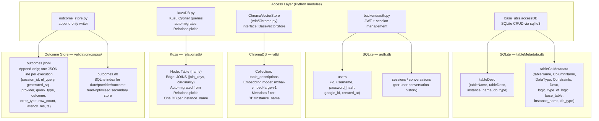

# Poly-QL — Storage Layer

All persistent stores and how they are accessed.

## What lives where

| Data | Store | Why |
|------|-------|-----|
| Table + column metadata, descriptions | SQLite (`tableMetadata.db`) | Structured, relational, fast point lookups by table name |
| Table description embeddings | ChromaDB | Cosine similarity search for RAG retrieval |
| JOIN relationships | Kuzu (embedded graph) | Graph traversal for join-path finding and lineage |
| User accounts, auth tokens | SQLite (`auth.db`) | Simple relational; PyJWT for token generation |
| Query execution outcomes | JSONL + SQLite index | JSONL for durability / portability; SQLite index for analytics queries |
| Session conversation history | `localStorage` (frontend) | No server-side session storage needed; 30-session cap |

## Instance isolation

All stores support `instance_name` scoping so multiple database environments (e.g. `prod_snowflake`, `dev_databricks`) can coexist:

- **SQLite**: `instance_name` column on `tableDesc` and `tableColMetadata`; queries filter by `WHERE instance_name = ?`
- **ChromaDB**: metadata filter `{"DB": instance_name}` on every collection query
- **Kuzu**: separate database directory per instance (`relationsdb/{instance_name}/`)

## Migration notes

- **NetworkX → Kuzu**: `kuzuDB.py` auto-detects `Relations.pickle` on first run and migrates edges into Kuzu; pickle is preserved but no longer read after migration
- **SQLite schema evolution**: New columns added via `ALTER TABLE ... ADD COLUMN` (non-breaking; existing rows default to `''` or `NULL`)
