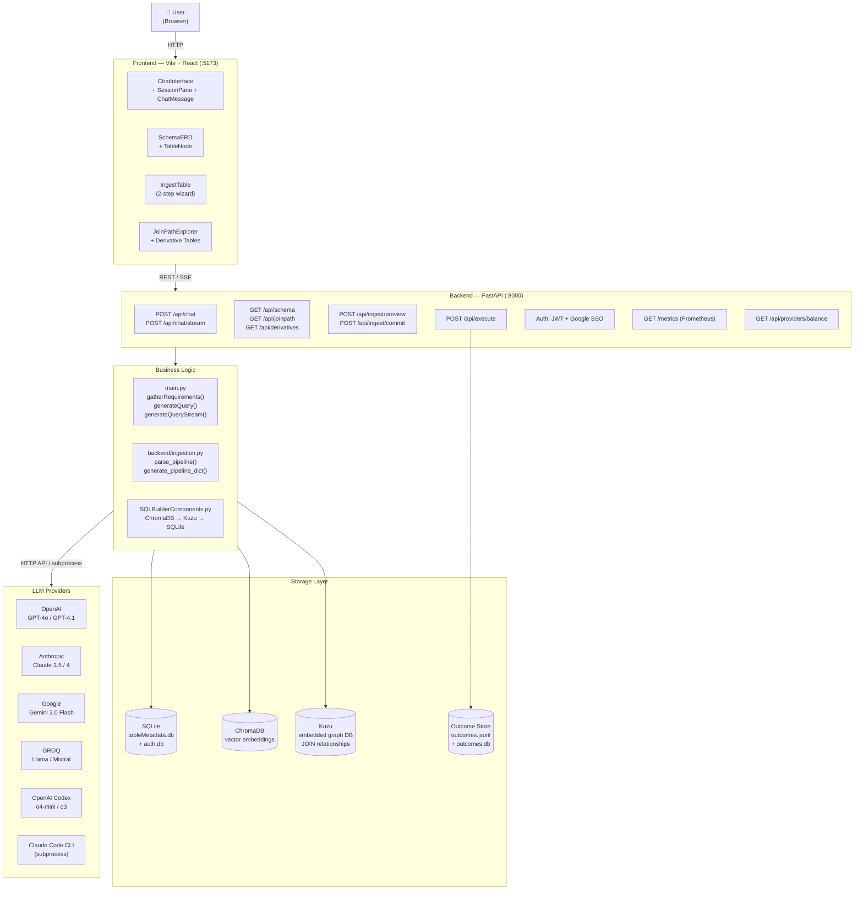

# Poly-QL — System Architecture

High-level view of all major components and their relationships.

## Component Responsibilities

| Component | Responsibility |
|-----------|----------------|
| `main.py` | Two-agent orchestration: requirement gathering loop + query generation |
| `SQLBuilderComponents.py` | RAG retrieval pipeline: ChromaDB search → Kuzu JOIN paths → SQLite column fetch |
| `backend/ingestion.py` | Pipeline SQL parsing + LLM-assisted data dictionary generation |
| `backend/balance.py` | Concurrent credit/availability checks for all LLM providers |
| `backend/auth.py` | JWT authentication, user accounts, Google SSO |
| `backend/metrics.py` | In-memory Prometheus counters; `GET /metrics` endpoint |
| `backend/logging_config.py` | JSON-structured log formatter; called once at FastAPI lifespan startup |
| `validation/outcome_store.py` | Appends execution outcomes to `outcomes.jsonl` + SQLite index |
